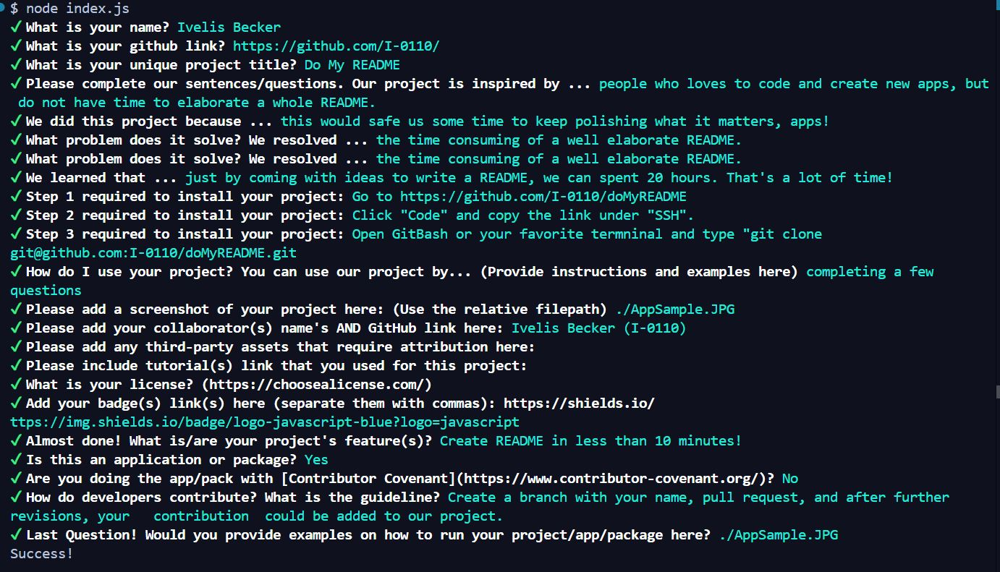

# DO MY README

## Description

Our Do My README is inspired by people who love to code more and write less. . We created this project because we were looking for an alternative that save us some time doing README's while we have more time to make sure our  projects and applications are working fine. . We resolved speding twenty hours building a professional README last time. . We learned that with an app like this one, we can save some time also in other details that we spent extra time, too. Like creating a slide presentation of our projects. (Plans for our next app).

## Table of Contents

- [Installation](#installation)
- [Usage](#usage)
- [Credits](#credits)
- [License](#license)

## Installation

Steps for installation:
Step 1: go to https://github.com/I-0110/doMyREADME
Step 2: click the button "code" and copy the link under "SSH"
Step 3: go to your favorite terminal. Clone and save the app in your computer and listo!

## Usage

You can use our Do My README by answering a few questions and publishing your professional README when you are done. .

    
    
## Credits

- Collaborator(s):
Ivelis Becker https://github.com/I-0110/

- Third Party(ies):

- Tutorial(s) used: 

## License

MIT License

## Badges

## Features

It creates almost a perfect README!

## How to Contribute

true application/package. 

false contributor covenant. 

You can send an email with your ideas or make a request, and after verifying, your contribution can be added  here. Make sure to share your  name, github , and email. 

## Tests

https://watch.screencastify.com/v/umAkhnBIDZ6Qo7W3fRXK 

Created by Ivelis Becker GitHub: I-0110

## Questions 

For questions, please contact Ivelis Becker, ivelisbecker@gmail.com, github.com/I-0110